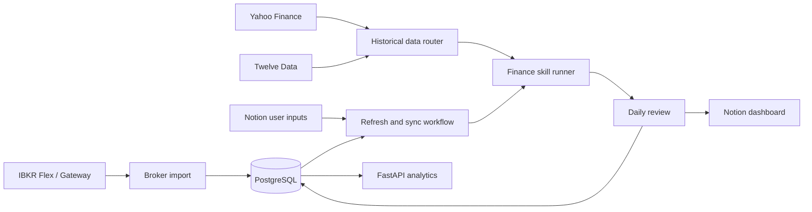

# PA Investing

PA Investing is a personal, analysis-only investing system. It imports a portfolio, normalizes
instrument identities across providers, refreshes market data, runs deterministic analysis, and
publishes a concise daily review to Notion.

The project is deliberately small at the core:

- **PostgreSQL** is the source of truth.
- **Python/FastAPI** owns workflows, validation, calculations, and APIs.
- **Notion** is the operating dashboard, not a database of record.
- **IBKR Flex** is the preferred portfolio import path.
- **Yahoo Finance** is the default daily-history provider; **Twelve Data** is the fallback.
- The system does **not** place orders or execute trades.

> This is personal research software, not investment advice. Validate data and decisions against
> broker records before acting on them.

## Project Status

The repository has a working end-to-end MVP rather than only scaffolding.

| Area | Current state |
| --- | --- |
| Portfolio ingestion | IBKR Flex, IBKR Client Portal Gateway for local testing, and CSV/demo paths |
| Instrument identity | Stable internal IDs plus Bloomberg-style references such as `ADBE US` and provider mappings |
| Current prices and FX | Mapped quotes, validation, persistence, and USD/GBP reporting conversion |
| Daily history | Validated, immutable datasets with Yahoo-to-Twelve-Data whole-series fallback |
| Finance analysis | Technical, candlestick, and market-risk skills with deterministic summaries |
| Daily review | Portfolio snapshot, signals, finance evidence, and Notion synchronization |
| Operations | Provider-run records, transaction ledger, and broker NAV/cash reconciliation records |
| Browser/API | Current portfolio, performance, history, operations, and workflow endpoints |
| Trade execution | Intentionally not implemented |

The current analytics are useful for daily monitoring, but returns and drawdown are not yet
cash-flow-aware. Treat them as indicative until deposits, withdrawals, dividends, fees, and broker
NAV reconciliation are fully incorporated into performance calculations.

## Architecture



The important boundaries are:

1. Provider symbols never become portfolio identity. Instruments have stable internal IDs.
2. Research uses readable canonical references; provider-specific symbols remain mappings.
3. Historical providers return one complete dataset. The router never silently stitches sources.
4. Finance skills consume validated evidence and return structured results. They do not fetch data,
   write PA signals, or synchronize Notion themselves.
5. The portfolio transaction commits before external Notion writes and finance enrichment.
6. A failed skill or provider is recorded and isolated rather than hidden.

## Repository Layout

```text
PAMASTER/
├── README.md                  # Project overview and contributor entry point
├── backend/
│   ├── README.md              # Detailed setup, environment, and operating runbook
│   ├── alembic/               # Database migrations
│   ├── src/pa_investing/
│   │   ├── analytics/         # Valuation, snapshots, and performance calculations
│   │   ├── api/               # FastAPI routes, schemas, and authentication
│   │   ├── brokers/           # CSV and IBKR connectors
│   │   ├── db/                # SQLAlchemy models and repositories
│   │   ├── finance/           # Reusable finance skills and orchestration
│   │   ├── instruments/       # Canonical references and provider resolution
│   │   ├── market_data/       # Current quotes, FX, and historical-data routing
│   │   ├── notion/            # Notion adapter and presentation mapping
│   │   ├── scripts/           # Runnable command-line entry points
│   │   └── workflows/         # Broker import, daily review, and refresh orchestration
│   └── tests/                 # Unit and integration tests
└── docs/                      # Design notes and implementation plans
```

## Quick Start

The backend requires Python 3.12 or newer. Run these commands from `backend/`:

```bash
python3 -m venv .venv
source .venv/bin/activate
pip install -e ".[dev]"
cp .env.example .env
alembic upgrade head
```

Safe local defaults keep Notion disabled and do not place trades:

```bash
PA_NOTION_ENABLED=false
PA_MARKET_DATA_PROVIDER=manual
```

Start the API:

```bash
.venv/bin/uvicorn pa_investing.main:app --reload
curl http://localhost:8000/health
```

Expected health response:

```json
{"status":"ok"}
```

For PostgreSQL and container deployment, use the
[UGREEN DXP4800 Plus operating runbook](backend/README.md#ugreen-dxp4800-plus-deployment).

## Normal Operating Workflow

### 1. Import the portfolio

For a real portfolio, configure `PA_IBKR_FLEX_TOKEN` and `PA_IBKR_FLEX_QUERY_ID`, then run:

```bash
.venv/bin/python -m pa_investing.scripts.import_ibkr_positions
```

IBKR Flex is preferred for scheduled NAS use because it does not require an interactive session.
The Client Portal Gateway remains available for local/manual testing. Neither connector submits
orders.

For a disposable local portfolio:

```bash
.venv/bin/python -m pa_investing.scripts.seed_demo_portfolio
```

### 2. Inspect identities and configure mappings

```bash
.venv/bin/python -m pa_investing.scripts.show_positions
.venv/bin/python -m pa_investing.scripts.import_market_data_mappings mappings.csv
```

A mapping connects one internal instrument to each provider representation:

```csv
instrument_id,provider,provider_symbol,provider_exchange,expected_currency,price_multiplier,enabled
your-smh-id,yahoo,SMH.L,,GBP,1,true
your-smh-id,twelve_data,SMH,LSE,GBP,1,true
```

Use `price_multiplier=0.01` when a provider returns GBX for an instrument stored in GBP.

### 3. Smoke-test data and analysis

Research mode accepts a readable canonical reference:

```bash
.venv/bin/python -m pa_investing.scripts.fetch_historical_data \
  --research "ADBE US" \
  --start 2025-07-15 \
  --end 2026-07-15

.venv/bin/python -m pa_investing.scripts.analyze_instrument \
  --research "ADBE US" \
  --as-of 2026-07-15
```

Portfolio mode uses the stable internal ID so there is no ambiguity:

```bash
.venv/bin/python -m pa_investing.scripts.analyze_instrument \
  --instrument-id your-instrument-id \
  --as-of 2026-07-15
```

### 4. Run the daily refresh

Start the API, then trigger the authenticated workflow:

```bash
curl -X POST http://localhost:8000/workflows/refresh-and-sync \
  -H "Authorization: Bearer $PA_WORKFLOW_API_TOKEN" \
  -H "Content-Type: application/json" \
  -d '{"stop_prices": {}}'
```

The workflow reads portfolio inputs, refreshes mapped prices and FX, commits the snapshot and
signals, runs finance evidence for eligible holdings, and updates the Notion dashboard.

For a scheduler or NAS task:

```bash
.venv/bin/python -m pa_investing.scripts.run_scheduled_snapshot
```

## Market Data and Instrument Routing

User-facing references follow a compact Bloomberg-style convention:

```text
ADBE US
GLEN LN
SMH LN
```

The resolver translates these references into provider-specific symbols such as Yahoo suffixes,
Twelve Data exchange pairs, or IBKR contract identifiers. Callers should not need to remember a
different ticker for every provider.

There are two deliberately different resolution modes:

- **Portfolio:** requires an internal instrument ID and explicit mappings; ambiguity fails closed.
- **Research:** searches candidates from a readable reference and returns ambiguity instead of
  guessing a listing.

Daily history defaults to Yahoo and falls back to Twelve Data only when the fallback can satisfy
the complete requested window. Accepted datasets retain provider, listing, currency, adjustment,
fetch time, warnings, and failed-attempt provenance. Adjusted OHLC is the default analysis series;
the least-adjusted companion series is retained when available.

## Using Finance Skills

The finance layer is a reusable library under `pa_investing.finance`. Its default bundle is:

```text
daily_market_review.v1
├── technical_snapshot.v1
├── candlestick_events.v1
└── market_risk_snapshot.v1
```

Use the full bundle by omitting `--skill`, or run one or more skills independently by repeating
the option:

```bash
.venv/bin/python -m pa_investing.scripts.analyze_instrument \
  --research "ADBE US" \
  --as-of 2026-07-15 \
  --skill technical_snapshot.v1

.venv/bin/python -m pa_investing.scripts.analyze_instrument \
  --research "ADBE US" \
  --as-of 2026-07-15 \
  --skill technical_snapshot.v1 \
  --skill market_risk_snapshot.v1
```

The default lookback is 365 calendar days. Override it with `--lookback-days`. Add
`--allow-stale` only when a caller explicitly accepts the last validated dataset.

Application code can use the same service for either purpose:

```python
portfolio_result = service.analyze_portfolio(
    instrument_id,
    as_of=review_date,
)

research_result = service.analyze_research(
    research_instrument,
    as_of=review_date,
    skill_ids=("technical_snapshot.v1",),
)
```

Every result contains dataset provenance, per-skill status, metrics, findings, warnings, and a
deterministic summary. Finance findings are supporting evidence in the daily review; they do not
automatically become portfolio signals.

## Adding a Finance Skill

A price-history skill is intentionally a small, testable class:

1. Add a module under `backend/src/pa_investing/finance/skills/`.
2. Give it versioned `SkillMetadata`, for example `relative_strength.v1`.
3. Implement `run(request, dataset) -> SkillResult` without network or database access.
4. Add focused unit tests under `backend/tests/unit/`.
5. Export it from `finance/skills/__init__.py` and register it in
   `finance/defaults.py`.
6. Add it to a bundle only if it belongs in that workflow's default review.

Minimal shape:

```python
class RelativeStrengthSkill:
    metadata = SkillMetadata(
        skill_id="relative_strength.v1",
        name="Relative strength",
        description="Compares recent price performance with a benchmark.",
        execution_mode=ExecutionMode.DETERMINISTIC,
        min_bars=60,
    )

    def run(self, request, dataset) -> SkillResult:
        # Pure calculation over an already validated dataset.
        return SkillResult(
            skill_id=self.metadata.skill_id,
            status=SkillStatus.SUCCESS,
            metrics={},
            findings=[],
        )
```

Registration is explicit:

```python
registry.register(RelativeStrengthSkill())
registry.register_bundle(
    "daily_market_review.v2",
    (
        "technical_snapshot.v1",
        "candlestick_events.v1",
        "market_risk_snapshot.v1",
        "relative_strength.v1",
    ),
)
```

Keep independent skills independent. A new skill should not import the PA workflow, Notion, or a
provider client. The service owns evidence retrieval; the orchestrator owns isolation and summary;
the caller decides whether the result is used for research, a watchlist, or a portfolio review.

### Future fundamental and news skills

Do not force fundamentals or news into `HistoricalDataset`. The current `FinanceSkill` protocol is
correctly narrow for price-based analysis. When the first non-price skill is implemented, introduce
a small analysis context containing optional, typed evidence such as price history, fundamentals,
and news. Let each skill declare its required evidence and fail clearly when it is unavailable.
Avoid a generic autonomous-agent framework until a real workflow needs one.

## API Surface

- `GET /health`
- `GET /analysis/portfolio`
- `GET /analysis/signal/{signal_id}`
- `GET /analysis/performance`
- `GET /analysis/current`
- `GET /analysis/transactions`
- `GET /analysis/operations`
- `GET /analysis/instruments/search?q={query}`
- `GET /analysis/market-data/{instrument_id}?start=YYYY-MM-DD&end=YYYY-MM-DD`
- `POST /analysis/market-data/research`
- `POST /workflows/refresh-and-sync`

Analytics routes can be protected with HTTP Basic authentication. The write workflow uses a
separate bearer token. See [backend/README.md](backend/README.md) for the complete environment and
Notion schema configuration.

## Development

Run the quality checks from `backend/`:

```bash
.venv/bin/python -m pytest
.venv/bin/ruff check .
```

Tests use SQLite in memory by default. Live-provider tests should remain opt-in and must not be
required for the deterministic unit suite.

When changing the system:

- put calculations in pure domain/analytics/finance code;
- keep provider behavior behind an interface;
- validate and persist provenance at ingestion boundaries;
- make external writes idempotent;
- isolate failures by provider, instrument, and skill;
- add a migration for persisted schema changes;
- prefer an explicit registry or dependency over dynamic magic.

## Recommended Next Step

The next milestone should be a **production daily-review reliability pass**, not another agent.
Treat the NAS deployment as accepted only after seven consecutive successful 06:00
Europe/London morning cycles.

1. Run the real IBKR → prices/FX → finance evidence → Notion workflow daily for one to two weeks.
2. Surface one run summary from the existing provider-run records, showing provider success,
   finance coverage, stale/missing data, and Notion synchronization status in one place.
3. Replace weekday-only history coverage expectations with exchange-aware trading calendars so
   normal market holidays do not appear as missing-session warnings.
4. Reconcile calculated NAV and cash with the IBKR report and make performance cash-flow-aware.
5. Only then add the first new evidence family—preferably fundamentals—using the typed analysis
   context described above.

This sequence tests the whole personal-assistant loop with real data before increasing analytical
breadth. News sentiment can follow fundamentals once source provenance, timestamps, and failure
behavior are defined.

## Known Limitations

- Performance returns and drawdown are not yet adjusted for cash flows.
- Historical coverage currently uses weekday expectations rather than exchange calendars, so
  holidays can produce harmless warnings.
- Daily finance analysis supports equities and ETFs with daily bars only.
- The default finance loop analyzes eligible holdings sequentially; large portfolios may need
  bounded concurrency later.
- Yahoo is convenient but unofficial and may change behavior; Twelve Data requires mappings and
  an API key.
- IBKR Flex is suitable for scheduled snapshots, not continuous real-time connectivity.
- Notion is eventually consistent with PostgreSQL and may fail after the core transaction commits.

## Further Documentation

- [Backend setup and operating runbook](backend/README.md)
- [System architecture design](docs/superpowers/specs/2026-07-07-pa-investing-system-architecture-design.md)
- [External Vibe Trading review](docs/superpowers/specs/2026-07-10-pa-investing-external-inspiration-note.md)
- [Finance skills and canonical references plan](docs/superpowers/plans/2026-07-16-finance-skills-and-canonical-references.md)
- [Historical-data routing plan](docs/superpowers/plans/2026-07-16-finance-library-historical-data-routing.md)
- [Daily review and Notion plan](docs/superpowers/plans/2026-07-16-daily-review-finance-notion.md)
